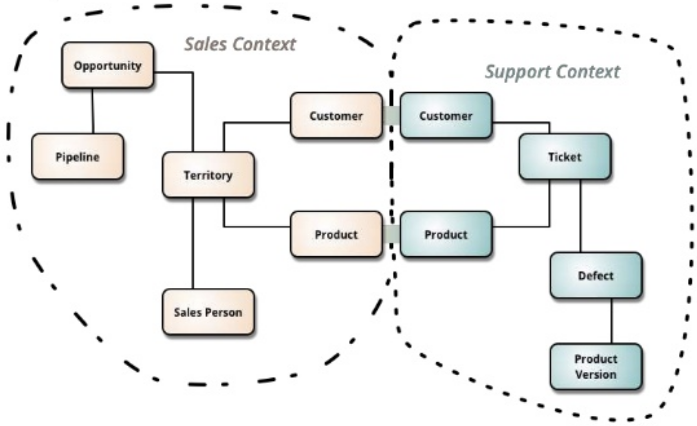
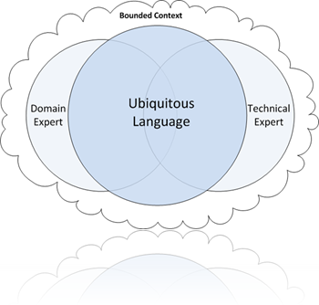
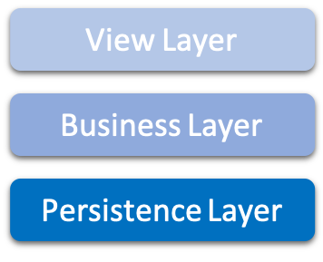
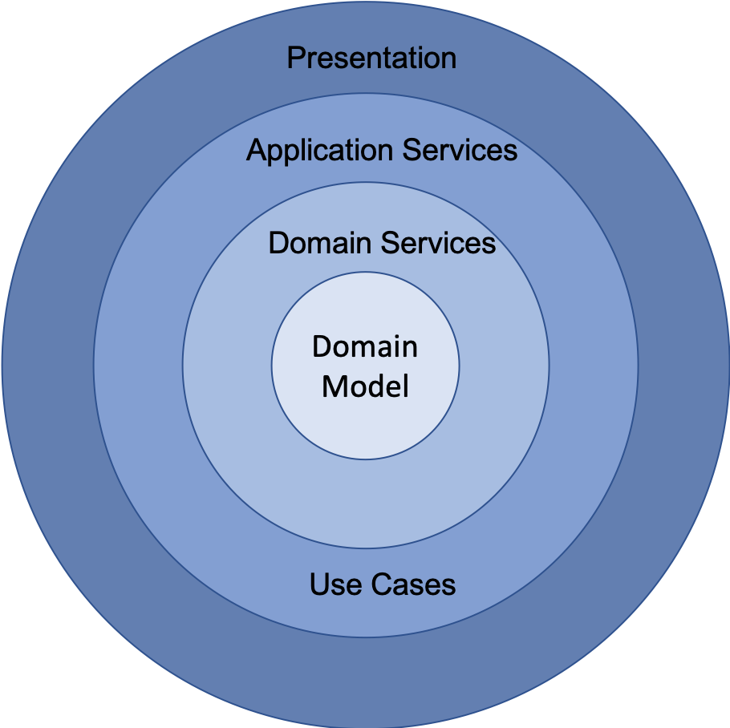
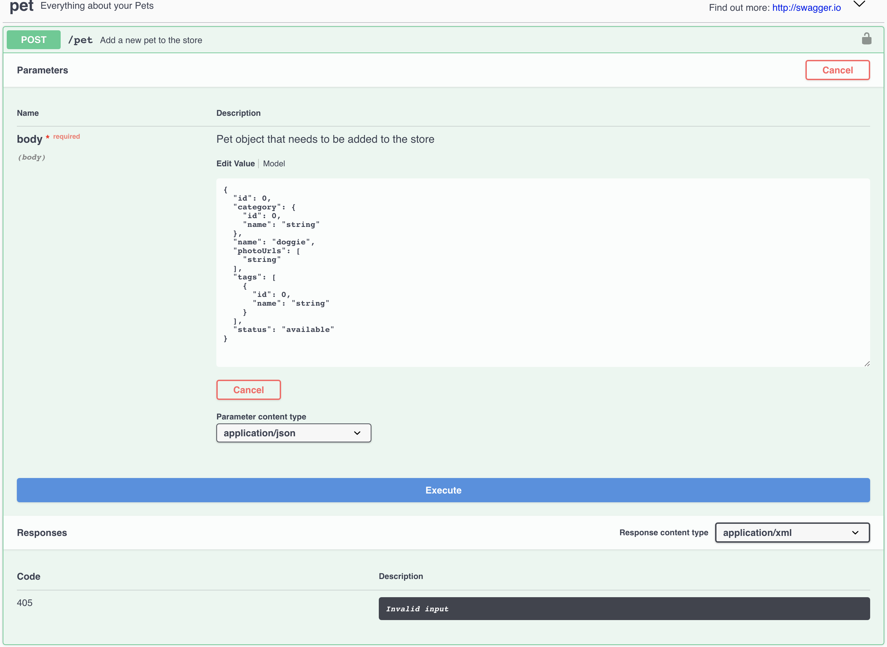

## Human Centric Architecture {data-background="http://fearlessdollar.com/wp-content/uploads/2013/08/Fearless-Background-1024-x-768-Lighter-Gray1.jpg"}

<p>
  <br />
  <br />
    Jacky Chan
  <br/><br/>
    <a href="http://linkedin.com/in/jackyarch">in/jackyarch</a><br/>
  <br />
</p>
<p>

[NEXT]

<h2>Human Centric Architecture</h2>

<table class="bio-table">
  <tr>
    <td style="float: left">
        
        <br>
        <font style="font-weight: bold; color: white">Jacky Chan</font>
        <br>
        <br>
    </td>
    <td style="float: left; color: white; font-size: 0.7em;">

        Executive Director - Architecture
        <br/>
        <a style="color: cyan" href="https://www.jpmorganam.com.hk">J.P. Morgan Asset & Wealth Management</a>
        <p/>
        Design Thinking Trainer
        <br/>
        <a style="color: cyan" href="https://www.experiencepoint.com">ExperiencePoint</a>
        <p/>
        Interested in
	<ul>
		<li>Machine Learning</li>
		<li>Design Thinking</li>
		<li>AppSec</li>
	</ul>

    </td>
  </tr>
</table>

### <a style="color: cyan" href="#">Contact me at: jackycct@gmail.com</a>
    
[NEXT]

## What is Architecture ?

[NEXT]

## Architecture is {data-background="https://www.publickey1.jp/blog/11/agileconf1102.jpg" data-background-opacity="0.2"}

> Shared understanding of the important stuff about a system

<br>
<i>~Martin Fowler</i>
<br>
<a style="color: cyan" href="https://martinfowler.com/ieeeSoftware/whoNeedsArchitect.pdf">Who needs an Architect?</a>

[NEXT]

## What is Human Centric Design

[NEXT]

## Human Centric Design is

> a holistic understanding of the <b>interests or needs of humans</b> who will receive or use the product, service or system.  

[NEXT]

Architecture
<br>
x
<br>
Human Centric

[NEXT]

## Challenges

> Translations
> <br/>
> Complex
> <br/>
> Waterfall and Reactive

[NEXT]

## Opportunities>

> Consistent
> <br/>
> Simple and Intuitive
> <br/>
> Agile and Responsive

[NEXT SECTION]

## Consistent

[NEXT]

## Domain-Driven Design
(DDD)

[NEXT]

### Bounded Context



* A entity is well defined in a bounded context
  * <b>Person</b> in sales bounded context refers to <b>Sales Person</b>

[NEXT]

### Ubiqitious Langauge



* A language used by all team members to connect all the activities of the team

[NEXT]

## Ubiqitious Langauge


* The same terminology is also used in
  * Jira stories
  * Application Code, Table and Column
  * Testing Cases
  * RESTful API Definition

[NEXT SECTION]

## Intuitive

[NEXT]

## Clean Architecture

<table>
  <tr>
   <td align="center">

<h5>Traditional Architecture</h5>


   </td>
   <td align="center">

<h5>Clean Architecture</h5>


   </td>
  </tr>
</table>

[NEXT]

## Intuitive REST API

* Industry Convention
* Swagger with examples

[NEXT]

## Industry Convention

> Use plural nouns to represent resources
###### /customers/2345
###### /accounts/A304935

[NEXT]

## Use proper HTTP Verb

* Read            
  * _GET_ /customers/2345 
  * _GET_ /customers?size=20&page=3 
* Create
  * _POST_ /customers/
* Replace whole
  * _PUT_ /customers/
* Modify delta
  * _PATCH_ /customers/
* Delete
  * _DELETE_ /customers/

[NEXT]

## Swagger with Examples



[NEXT]

## Functional Testing

* Given
* When
* And
* Then
* And

[NEXT]

* Scenario: Login with bad password
  * Given lauch URL http://app/login
  * When http get parameter user id equals to 'Jacky'
  * And http get parameter password equals to '********'
  * Then error page is returned 

[NEXT]

## A better approach

* Scenario: Login with bad password
  * Given I launch app using browser Chrome
  * When I type user name 'Jacky' 
  * And I type an incorrect password 
  * Then I see error message "Invalid username/password"
  * And I stay on the login page

#### Ubiquitous Languages
#### Living Documentation

[NEXT]

## from Javadoc to self-descriptive code

```Java
/** 
 * Find customers who have more than a given amount in saving account
 * @param amount Amount in Saving Account
 */
public Customer findCustomer(BigDecimal amount);
```

```Java
public Customer findCustomersWithSavingAccountMoreThan(
	BigDecimal usdAmount);
```


[NEXT SECTION]

## Agile and Responsive

[NEXT]

## People improve through feedback

[NEXT]

## How might architecture get feedback for improvement?

[NEXT]

## Service Level Objectives (SLO)

* Key Measurable Characteristics
  * availability
  * throughput
  * response time
  * resiliency

[NEXT]

## Design automated measurement for SLO into architecture

[NEXT]

## Responsive architecture


[NEXT SECTION]

### Slides

https://goo.gl/ex1u87


[NEXT]

<h2>Human Centric Architecture</h2>

<table class="bio-table">
  <tr>
    <td style="float: left">
        
        <br>
        <font style="font-weight: bold; color: white">Jacky Chan</font>
        <br>
        <br>
    </td>
    <td style="float: left; color: white; font-size: 0.7em;">

        Executive Director - Architecture
        <br/>
        <a style="color: cyan" href="https://www.jpmorganam.com.hk">J.P. Morgan Asset & Wealth Management</a>
        <p/>

    	LinkedIn: 
	<a href="http://linkedin.com/in/jackyarch">in/jackyarch</a><br/>
	
    </td>
  </tr>
</table>


